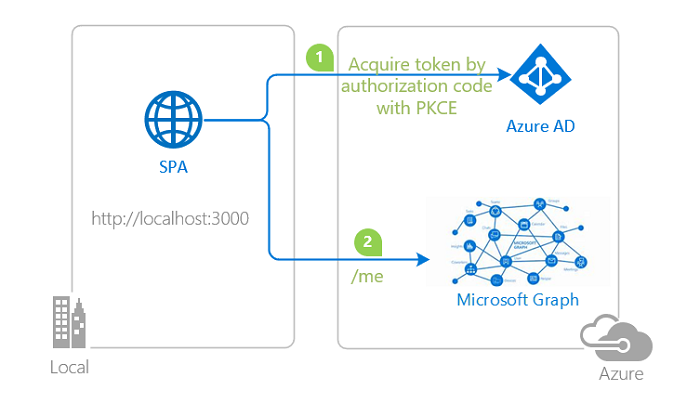

# Vanilla JavaScript single-page application using MSAL.js to authenticate users to call Microsoft Graph

* [Overview](#overview)
* [Scenario](#scenario)
* [Contents](#contents)
* [Prerequisites](#prerequisites)
* [Setup the sample](#setup-the-sample)
* [Explore the sample](#explore-the-sample)
* [Troubleshooting](#troubleshooting)
* [About the code](#about-the-code)
* [Next Steps](#next-steps)
* [Contributing](#contributing)
* [Learn More](#learn-more)

## Overview

This sample demonstrates a Vanilla JavaScript single-page application that lets users authenticate against [Microsoft Entra ID](https://docs.microsoft.com/azure/active-directory/fundamentals/active-directory-whatis) (Microsoft Entra ID) using the [Microsoft Authentication Library for JavaScript](https://github.com/AzureAD/microsoft-authentication-library-for-js) (MSAL.js), then acquires an **[Access Token](https://aka.ms/access-tokens)** for Microsoft Graph and calls the [Microsoft Graph API](https://docs.microsoft.com/graph/overview). In doing so, it also illustrates various authorization concepts, such as [Access Tokens](https://docs.microsoft.com/azure/active-directory/develop/access-tokens), [Authorization Code Grant](https://docs.microsoft.com/azure/active-directory/develop/v2-oauth2-auth-code-flow), [Dynamic Scopes and Incremental Consent](https://docs.microsoft.com/azure/active-directory/develop/v2-permissions-and-consent), **silent requests** and more.

In addition, this sample also demonstrates how to use the [Microsoft Graph JavaScript SDK](https://github.com/microsoftgraph/msgraph-sdk-javascript) client with MSAL as a custom authentication provider to query the Graph API. Note that you are not required to implement a custom provider, as the v3.0 (preview) of the SDK offers a [default provider](https://github.com/microsoftgraph/msgraph-sdk-javascript/blob/dev/docs/AuthCodeMSALBrowserAuthenticationProvider.md) that implements MSAL.js.

> :information_source: To learn how applications integrate with [Microsoft Graph](https://aka.ms/graph), consider going through the recorded session:: [An introduction to Microsoft Graph for developers](https://www.youtube.com/watch?v=EBbnpFdB92A)

## Scenario

1. The client application uses the **MSAL.js** to sign-in a user and obtain a JWT **Access Token** from **Microsoft Entra ID**:
1. The **Access Token** is used as a *bearer* token to authorize the user to call the **Microsoft Graph API**.
1. **Microsoft Graph API** responds with the resource that the user has access to.

## Contents

| File/folder           | Description                                                               |
|-----------------------|---------------------------------------------------------------------------|
| `AppCreationScripts/` | Contains Powershell scripts to automate app registration.                 |
| `App/authPopup.js`    | Main authentication logic resides here (using Popup flow).                |
| `App/authRedirect.js` | Use this instead of `authPopup.js` for authentication with redirect flow. |
| `App/authConfig.js`   | Contains configuration parameters for the sample.                         |
| `App/graph.js`        | Implements custom authentication provider for Graph SDK.                  |
| `App/ui.js`           | Contains UI logic.                                                        |
| `server.js`           | Simple Express server for `index.html`.                                   |

## Prerequisites

* [Node.js](https://nodejs.org/en/download/) must be installed to run this sample.
* [Visual Studio Code](https://code.visualstudio.com/download) is recommended for running and editing this sample.
* [VS Code Azure Tools](https://marketplace.visualstudio.com/items?itemName=ms-vscode.vscode-node-azure-pack) extension is recommended for interacting with Azure through VS Code Interface.
* A modern web browser.
* An **Microsoft Entra ID** tenant. For more information, see: [How to get a Microsoft Entra tenant](https://docs.microsoft.com/azure/active-directory/develop/test-setup-environment#get-a-test-tenant)
* A user account in your **Microsoft Entra ID** tenant.

>This sample will not work with a **personal Microsoft account**. If you're signed in to the [Microsoft Entra admin center](https://entra.microsoft.com) with a personal Microsoft account and have not created a user account in your directory before, you will need to create one before proceeding.
